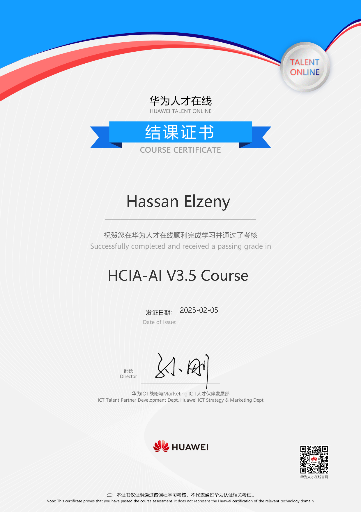

<h1 align="center">🚀 Hassan Anees Elzeny</h1>
<h3 align="center">AI & Computer Science Enthusiast</h3>

  

  

---

## 👋 About Me

Hi there! I'm **Hassan Anees Elzeny**, a passionate AI enthusiast and Computer & Artificial Intelligence student at MTI University in Cairo (Expected Graduation: 2025). I thrive on solving complex problems and love exploring new technologies to make a meaningful impact through AI.

- 🔭 I’m currently working on innovative AI projects.
- 🌱 Continuously enhancing my skills in Machine Learning, Data Science, and Software Development.
- 💡 I enjoy creating interactive projects and staying on top of tech trends.
- 📫 Reach me at: [hassananees188@gmail.com](mailto:hassananees188@gmail.com)

---

## 💻 What I Do

- **AI Engineering & Data Science:** Building AI models, training machine learning algorithms, and preparing clean, insightful datasets.
- **Programming:** Proficient in Python and C++ for developing applications and automating tasks.
- **Data Analysis & Visualization:** Crafting interactive visualizations with Pandas, Matplotlib, Seaborn, and Plotly.
- **Virtual Assistance & Content Creation:** Managing YouTube and TikTok channels along with administrative support.

---
## 🛠️ Tech Stack & Libraries

### Programming Languages & General Tools

  
  
  

### Web Development

  
  
  
  

### Python Libraries

  
  
  
  
  
  
  
  
  
  
  
  
  
  
  
  
  

### Mobile & App Development

  
  
  

### Databases, Cloud & DevOps

  
  
  
  
  
  
  
  
  
  

### Additional Tools & Platforms

  
  
  
  
  
  
  
  
  

---

## 📂 Featured Projects

- **Netflix Trends Analysis:** Data visualization & analysis using NumPy, Pandas, Seaborn & Plotly.
- **Heart Failure Prediction:** AI model built with TensorFlow, Keras, and PyTorch.
- **Traffic Sign Detection:** Object detection project using Detectron2.
- **Market Scraper:** Web scraping tool using Scrapy & BeautifulSoup.
- **Employee Attrition Analysis:** Machine learning model analyzing factors affecting employee retention.

*More projects coming soon – stay tuned!*

---

## 🎓 Certifications & Courses

- **AI Career Essentials** - ALX *(May 2024)*
- **Data Science & Analytics** - HP *(September 2024)*
- **Virtual Assistant Training** - ALX *(Ongoing)*
- **SKY Distribution Training Program** *(October 2024)*
- **AI & Data Science Track - Digital Egypt Pioneers Initiative (DEPI)** *(Oct 2024 - May 2025)*
- **Huawei HICA - Cloud Computing & AI** (📅 January - February 2025)  
  

---

## 📊 GitHub Stats

---

## 🔗 Let's Connect!

  
  
  
  
  
  
  
  

---

## 🎮 Fun Interactive Section

  <!-- Animated Snake Game (if enabled on your repo) -->
  

---

  <h3>Visitor Count</h3>
  

---

<em>Made with ❤️ and lots of ☕ by Hassan Anees Elzeny</em>

